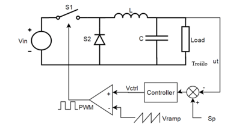

# LED Light Regulator (Linear Constant Current Driver)

## Project Overview
This project presents the design and implementation of a **linear LED light regulator** intended for driving high‑power LEDs using a **constant current topology**. The system was developed as a final engineering project and includes:

- Electrical design of LED voltage and current regulation
- Implementation of a linear regulator used as a constant current driver
- Thermal considerations for power dissipation
- Parallel LED branch configuration
- Custom designed 3D printed enclosure
- Passive airflow cooling

The goal of the system is to provide a stable current supply for high‑power LEDs (~350 mA per LED branch), ensuring reliable luminous output while protecting LEDs from thermal runaway and overcurrent conditions.

---

## Theory of Operation

### Linear Regulators
A linear regulator controls output voltage or current by dissipating excess electrical energy in the form of heat through a pass element operating in its linear region.

#### Advantages
- Simple implementation
- Low electrical noise
- High reliability
- Minimal electromagnetic interference (EMI)

#### Disadvantages
- Low efficiency at higher power levels
- Power loss proportional to voltage drop across regulator
- Requires thermal management


### Switching Regulators (Reference)
Switching regulators regulate voltage or current by rapidly switching a transistor on and off and transferring energy through inductive or capacitive elements.

#### Advantages
- Higher efficiency
- Minimal energy loss
- Can step voltage up or down

#### Disadvantages
- More complex circuitry
- Increased cost
- EMI generation

This project intentionally uses a **linear regulation approach** due to simplicity and predictable behavior in constant current LED applications.

---

## LED Voltage Regulation

Each high‑power LED used in this system requires approximately:

```
Forward Voltage (Vf) ≈ 3.5 V
```

To obtain the required operating voltage:

- Two LEDs are connected **in series**

Therefore:

```
Total LED Forward Voltage:
V_total ≈ 3.5 V + 3.5 V ≈ 7 V
```

A linear voltage regulator is used in combination with resistors to maintain stable voltage across each LED series branch.

---

## LED Current Regulation

High‑power LEDs must be driven using **constant current** rather than constant voltage.

Target operating current per LED branch:

```
I_branch ≈ 350 mA
```

System configuration:

- Two identical LED series branches
- Connected in **parallel**

Total required current:

```
I_total ≈ 350 mA + 350 mA ≈ 700 mA
```

A linear regulator configured as a **constant current source** is used to control the current through both parallel branches.

Current regulation is achieved using a sense resistor:

```
I = Vref / Rsense
```

Where:

- `I` = output current
- `Vref` = regulator reference voltage
- `Rsense` = current sense resistor

---

## Power Dissipation

Since this is a linear system, power dissipated by the regulator is:

```
P_loss = (Vin − Vled) × I
```

This power is converted into heat and must be removed through:

- Heatsinking
- Airflow ventilation
- Enclosure thermal design

Ventilation openings are included in the enclosure to improve passive cooling.

---

## Enclosure Design

The enclosure was designed using:

- Tinkercad CAD software

Design features:

- Separate removable top cover
- Screw‑mounted lid
- LED mounting cutouts
- Ventilation slots
- Power input opening
- Fan airflow path

Total design time:

```
≈ 11 hours
```

The enclosure was manufactured using a 3D printing process.

---

## Electrical Configuration Summary

| Parameter | Value |
|-----------|--------|
| LED Forward Voltage | ~3.5 V |
| LEDs per Series Branch | 2 |
| Voltage per Branch | ~7 V |
| Branch Current | 350 mA |
| Number of Branches | 2 |
| Total Current | 700 mA |
| Regulation Type | Linear Constant Current |

---

## Assembly

1. Connect LEDs in series pairs
2. Connect both series pairs in parallel
3. Install current sense resistor
4. Mount regulator to heatsink
5. Insert electronics into enclosure
6. Route power supply wiring
7. Secure enclosure lid using screws

---

## Future Improvements

- Switching regulator implementation for efficiency
- Active cooling system
- PWM dimming control
- Integrated temperature monitoring
- PCB implementation

---

# Project Images

## Presentation Images





---

## Real Device Photos


---

## License

This project is released for educational and research purposes.

